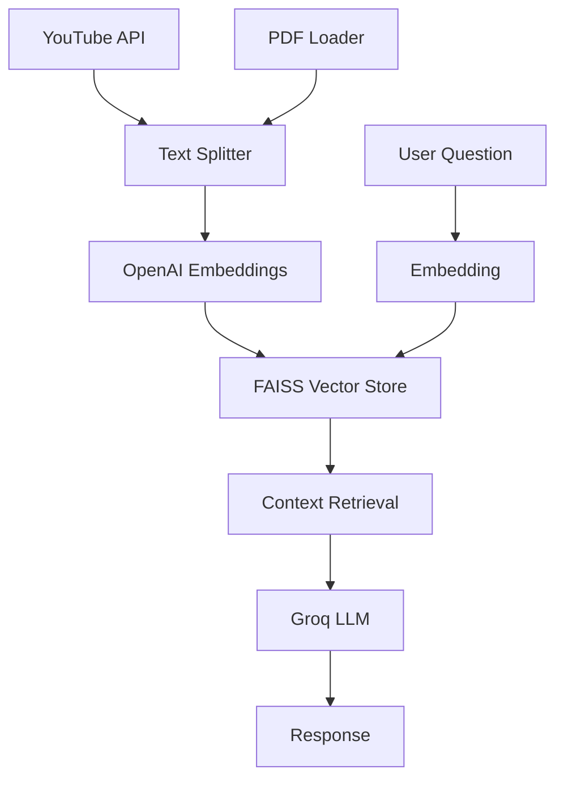

# 🔍 Attention Mechanism RAG Assistant

A sophisticated Retrieval-Augmented Generation (RAG) application that provides intelligent answers about the groundbreaking "Attention Is All You Need" paper using both YouTube video explanations and the original research paper.


## 🌟 Features

### 🎯 Core Functionality
- **Dual Source RAG**: Combines information from YouTube video transcript and original research paper
- **Intelligent Q&A**: Ask complex questions about transformer architecture and attention mechanisms
- **Fast Responses**: Powered by Groq's lightning-fast Llama 3.3 70B model
- **Semantic Search**: Uses OpenAI embeddings with FAISS vector database for accurate retrieval
- **Rich UI**: Beautiful, responsive Streamlit interface with custom styling

### 📚 Knowledge Sources
1. **YouTube Video**: Technical explanation of the Attention paper (ID: bCz4OMemCcA)
2. **Research Paper**: Original "Attention Is All You Need" PDF document
3. **Comprehensive Coverage**: Architecture details, self-attention, multi-head attention, positional encoding

### 🔧 Technical Stack
- **Frontend**: Streamlit with custom CSS styling
- **LLM**: Groq Llama 3.3 70B for fast, accurate responses
- **Embeddings**: OpenAI text-embedding-3-small for semantic understanding
- **Vector Database**: FAISS for efficient similarity search
- **Framework**: LangChain for RAG pipeline orchestration
- **Document Processing**: PyPDF for PDF parsing, YouTube Transcript API

## 🚀 Quick Start

### Prerequisites
- Python 3.8 or higher
- API keys for OpenAI and Groq
- Git for cloning the repository

### Installation

1. **Clone the repository**
   ```bash
   git clone <your-repo-url>
   cd rag_transformer_youtubetranscript_genai
   ```

2. **Create virtual environment**
   ```bash
   python -m venv venv
   
   # On Windows
   venv\Scripts\activate
   
   # On macOS/Linux
   source venv/bin/activate
   ```

3. **Install dependencies**
   ```bash
   pip install -r requirements.txt
   ```

4. **Set up environment variables**
   
   Create a `.env` file in the root directory:
   ```env
   # Required API Keys
   OPENAI_API_KEY=your_openai_api_key_here
   GROQ_API_KEY=your_groq_api_key_here
   
   # Optional: LangChain Tracing (for debugging)
   LANGCHAIN_API_KEY=your_langchain_api_key
   LANGCHAIN_PROJECT=your_project_name
   LANGCHAIN_TRACING_V2=true
   LANGCHAIN_ENDPOINT=https://api.smith.langchain.com
   ```

5. **Run the application**
   ```bash
   streamlit run app.py
   ```

6. **Access the app**
   
   Open your browser and navigate to `http://localhost:8501`

## 📖 How to Use

### Getting Started
1. **Initialize the System**: Click "🚀 Initialize RAG System" in the sidebar
2. **Wait for Loading**: The app will load YouTube transcript and PDF content
3. **Start Asking**: Type your questions in the input field
4. **Explore**: Use example questions or ask your own

### Example Questions
- "What is the self-attention mechanism and how does it work?"
- "How do transformers differ from RNNs and CNNs?"
- "What are the key components of the transformer architecture?"
- "How does multi-head attention improve the model?"
- "What is positional encoding and why is it needed?"
- "What were the main results and achievements of this paper?"

### Features Overview
- **Paper Summary**: Expandable section with key insights about the Attention paper
- **Chat Interface**: Conversational Q&A with chat history
- **System Status**: Real-time status indicators in the sidebar
- **Quick Info**: Technical specifications and metrics
- **Example Questions**: Pre-defined questions to get started

## 🏗️ Architecture

### RAG Pipeline
```
User Question → Embedding → Vector Search → Context Retrieval → LLM → Response
```

### Components
1. **Document Ingestion**: Loads YouTube transcript and PDF content
2. **Text Splitting**: Chunks content with overlap for better context
3. **Embedding**: Converts text to vectors using OpenAI embeddings
4. **Vector Store**: FAISS database for fast similarity search
5. **Retrieval**: Finds most relevant context for user questions
6. **Generation**: Groq LLM generates comprehensive answers

### Data Flow


## 🔑 API Keys Setup

### OpenAI API Key
1. Visit [OpenAI Platform](https://platform.openai.com/)
2. Sign up or log in to your account
3. Navigate to API Keys section
4. Create a new secret key
5. Add to your `.env` file

### Groq API Key
1. Visit [Groq Console](https://console.groq.com/)
2. Sign up for an account
3. Generate an API key
4. Add to your `.env` file

### LangChain (Optional)
1. Visit [LangSmith](https://smith.langchain.com/)
2. Create an account and project
3. Get your API key
4. Add to your `.env` file for debugging/tracing

## 📁 Project Structure

```
rag_transformer_youtubetranscript_genai/
├── app.py                          # Main Streamlit application
├── requirements.txt                # Python dependencies
├── .env                           # Environment variables (create this)
├── .gitignore                     # Git ignore file
├── README.md                      # This file
├── Attention.pdf                  # Research paper PDF
└── rag_using_langchain.ipynb     # Development notebook
```

## 🎨 Customization

### Styling
The app uses custom CSS for enhanced UI. Modify the CSS in `app.py` to change:
- Color schemes
- Layout spacing
- Component styling
- Typography

### Model Configuration
Easily switch models by modifying the `setup_models()` method:
```python
# Change LLM model
self.llm = ChatGroq(
    model="llama-3.1-8b-instant",  # Faster alternative, or use llama-3.3-70b-versatile for current production
    temperature=0.1,
    max_tokens=500
)

# Change embedding model
self.embeddings = OpenAIEmbeddings(model="text-embedding-ada-002")
```

### Retrieval Parameters
Adjust retrieval settings in `create_vector_store()`:
```python
# Change chunk size and overlap
text_splitter = RecursiveCharacterTextSplitter(
    chunk_size=500,    # Smaller chunks
    chunk_overlap=100  # Less overlap
)

# Change retrieval parameters
self.retriever = self.vector_store.as_retriever(
    search_type="similarity",
    search_kwargs={"k": 6}  # Retrieve more documents
)
```

## 🚀 Deployment

### Streamlit Cloud
1. Push your code to GitHub
2. Visit [Streamlit Cloud](https://streamlit.io/cloud)
3. Connect your GitHub repository
4. Set environment variables in the dashboard
5. Deploy with one click

### Local Deployment
```bash
# Install additional production dependencies
pip install gunicorn

# Run with custom port
streamlit run app.py --server.port 8080
```

### Docker Deployment
Create a `Dockerfile`:
```dockerfile
FROM python:3.9-slim

WORKDIR /app
COPY requirements.txt .
RUN pip install -r requirements.txt

COPY . .

EXPOSE 8501

CMD ["streamlit", "run", "app.py", "--server.port=8501", "--server.address=0.0.0.0"]
```

## 🔧 Troubleshooting

### Common Issues

**1. API Key Errors**
- Ensure all required API keys are set in `.env`
- Check API key validity and quotas
- Verify environment variable loading

**2. PDF Loading Issues**
- Ensure `Attention.pdf` is in the root directory
- Check file permissions
- Verify PDF is not corrupted

**3. YouTube Transcript Errors**
- Video might not have captions available
- Check internet connectivity
- Verify video ID is correct
- Ensure youtube-transcript-api is properly installed

**4. Memory Issues**
- Reduce chunk size in text splitter
- Decrease the number of retrieved documents
- Use smaller embedding models

**5. Slow Performance**
- Check internet connection
- Verify API quotas and limits
- Consider using faster models

### Debug Mode
Enable LangChain tracing for detailed debugging:
```python
os.environ["LANGCHAIN_TRACING_V2"] = "true"
```

## 📊 Performance Metrics

### Typical Response Times
- **System Initialization**: 30-60 seconds
- **Question Processing**: 2-5 seconds
- **Document Retrieval**: 0.1-0.5 seconds
- **LLM Generation**: 1-3 seconds

### Resource Usage
- **Memory**: ~500MB-1GB depending on content size
- **Storage**: ~50MB for vector indices
- **API Calls**: 1 embedding + 1 LLM call per question

## 🤝 Contributing

We welcome contributions! Here's how to get started:

1. **Fork the repository**
2. **Create a feature branch**
   ```bash
   git checkout -b feature/your-feature-name
   ```
3. **Make your changes**
4. **Add tests** (if applicable)
5. **Commit your changes**
   ```bash
   git commit -m "Add your feature description"
   ```
6. **Push to your branch**
   ```bash
   git push origin feature/your-feature-name
   ```
7. **Create a Pull Request**

### Development Setup
```bash
# Install development dependencies
pip install -r requirements.txt
pip install black flake8 pytest

# Run code formatting
black app.py

# Run linting
flake8 app.py

# Run tests (if available)
pytest
```

## 📚 References

### Research Paper
- **Title**: "Attention Is All You Need"
- **Authors**: Ashish Vaswani, Noam Shazeer, Niki Parmar, et al.
- **Year**: 2017
- **Link**: [arXiv:1706.03762](https://arxiv.org/abs/1706.03762)

### Technical Resources
- [Transformer Architecture Explained](https://jalammar.github.io/illustrated-transformer/)
- [The Annotated Transformer](http://nlp.seas.harvard.edu/2018/04/03/attention.html)
- [LangChain Documentation](https://python.langchain.com/)
- [Streamlit Documentation](https://docs.streamlit.io/)

## 📄 License

This project is licensed under the MIT License - see the [LICENSE](LICENSE) file for details.

## 🙏 Acknowledgments

- **Vaswani et al.** for the groundbreaking Attention paper
- **OpenAI** for providing excellent embedding models
- **Groq** for fast inference capabilities
- **LangChain** for the RAG framework
- **Streamlit** for the amazing web app framework

## 📞 Support

If you encounter any issues or have questions:

1. **Check the troubleshooting section** above
2. **Search existing issues** in the GitHub repository
3. **Create a new issue** with detailed information
4. **Contact the maintainers** for urgent issues

---

**Made with ❤️ for the AI and NLP community**

*This RAG application demonstrates the power of combining multiple knowledge sources to create intelligent, context-aware AI assistants. Perfect for researchers, students, and practitioners interested in transformer architectures and attention mechanisms.*
